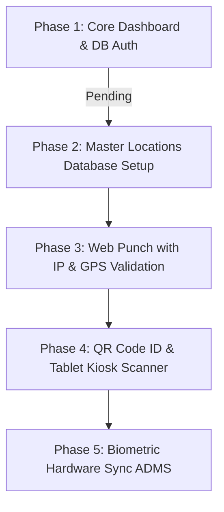

# 🚀 WorkNest Technologies - Unified Attendance Integration Roadmap

This document outlines the complete workflow, database schema design, API structure, and step-by-step roadmap for implementing a real-world, fraud-free hybrid attendance tracking system in WorkNest EMS.

---

## 🎯 Objective
To build a SaaS-grade **Unified Attendance Ingestion Gateway** supporting three key modes:
1. **Office Staff:** Tablet QR Kiosk / Wi-Fi IP Lock.
2. **WFH (Work From Home) Staff:** Home IP tracking & optional selfie check-in.
3. **Field Operations (Sales):** GPS Geofencing against pre-registered client sites.

---

## 💻 Technical Workflows & Use Cases

### 1. Office Staff (Tablet QR Kiosk / Geofenced Web Punch)
*   **Workflow A (QR Kiosk):**
    *   Employee opens their WorkNest Web/Mobile app to view their personal, dynamic QR code.
    *   A common tablet (iPad/Android) is mounted at the office entrance running the **WorkNest Kiosk App/Webpage**.
    *   Tablet camera scans the employee's QR code.
    *   The kiosk sends a payload to the backend: `POST /api/v1/attendance/scan-qr`.
    *   *Security:* To prevent screenshot sharing, the QR code regenerates a dynamic token every 10 seconds.
*   **Workflow B (Direct Web Punch):**
    *   Employee clicks "Clock In" on their laptop/PC.
    *   *Security:* The server checks if the employee's public IP matches the whitelist (Office broadband Wi-Fi).

### 2. WFH Staff (Self-Service Portal Check-In)
*   **Workflow:**
    *   Employee logs into their portal from home and selects the "WFH" mode.
    *   Upon clicking "Clock In", the system logs their IP address and optionally opens the webcam for a quick, automatic face snapshot (anti-spoofing).
    *   *Security:* Restricts punches if the IP location country does not match the employee's registered state.

### 3. Field Operations (GPS Tagged Client Site Punch)
*   **Workflow:**
    *   Sales or offsite employee goes to a client site (e.g. "TCS Office", "Client Warehouse").
    *   Employee selects the Client/Site Name from a dropdown on their mobile browser/app and clicks "Clock In".
    *   The app accesses the phone's GPS sensor to fetch latitude & longitude coordinates.
    *   The backend calculates the distance between the employee's coordinates and the pre-registered client coordinates.
    *   *Security (Geofencing):* Punch is successfully registered only if the calculated distance is **less than 200 meters**. Otherwise, the punch is rejected.

---

## 🗄️ Proposed Database Schema Design

To transition from mock JSON data to a real database, we will create the following migrations:

### 1. `office_branches_and_clients` (Branch/Client Sites Master)
Stores authorized locations for geofencing and IP validations.
```sql
CREATE TABLE office_branches_and_clients (
    id INT AUTO_INCREMENT PRIMARY KEY,
    name VARCHAR(255) NOT NULL, -- e.g. "Mumbai HQ", "Delhi Branch", "TCS Office Site"
    type ENUM('branch', 'client') NOT NULL DEFAULT 'client',
    latitude DECIMAL(10, 8) NULL,
    longitude DECIMAL(11, 8) NULL,
    geofence_radius_meters INT DEFAULT 200,
    allowed_ip_addresses VARCHAR(255) NULL, -- comma separated IPs for office Wi-Fi
    created_at TIMESTAMP DEFAULT CURRENT_TIMESTAMP
);
```

### 2. `attendance_logs` (Master Logs)
Stores every punch event with metadata.
```sql
CREATE TABLE attendance_logs (
    id INT AUTO_INCREMENT PRIMARY KEY,
    user_id INT NOT NULL, -- Reference to users table
    date DATE NOT NULL,
    clock_in DATETIME NOT NULL,
    clock_out DATETIME NULL,
    work_mode ENUM('Office', 'WFH', 'Field') NOT NULL DEFAULT 'Office',
    location_id INT NULL, -- Reference to office_branches_and_clients
    in_ip VARCHAR(45) NULL,
    out_ip VARCHAR(45) NULL,
    in_gps VARCHAR(100) NULL, -- e.g. "19.0760, 72.8777"
    out_gps VARCHAR(100) NULL,
    work_hours DECIMAL(5,2) NULL, -- Calculated during clock-out
    status ENUM('On Time', 'Late', 'On Break', 'Checked Out', 'Absent') DEFAULT 'On Time',
    field_remarks TEXT NULL, -- Optional notes from field visits
    created_at TIMESTAMP DEFAULT CURRENT_TIMESTAMP,
    FOREIGN KEY (user_id) REFERENCES users(id),
    FOREIGN KEY (location_id) REFERENCES office_branches_and_clients(id)
);
```

---

## 🔌 API Gateway Endpoints

We will implement a secure controller `App\Http\Controllers\Api\AttendanceApiController.php` handling:

*   **`POST /api/v1/attendance/web-punch`**
    *   *Role:* Handles Web Portal clock-in/out.
    *   *Validations:* Geofence check (for Office/Field) or IP range check.
*   **`POST /api/v1/attendance/scan-qr`**
    *   *Role:* QR scanner tablet endpoint.
    *   *Payload:* `{ "qr_token": "JWT_token_containing_user_id_and_timestamp" }`
*   **`POST /api/v1/attendance/biometric-push`**
    *   *Role:* ADMS biometric hardware log sync.
    *   *Payload:* `{ "device_serial": "XXXX", "user_pin": "104", "punch_time": "2026-06-22 09:00:00" }`

---

## 🗺️ Execution Phase Roadmap



### Phase 1: Core Dashboard Migration (Base System)
*   Complete the rest of the Admin Dashboard and Employee Dashboard database integrations.
*   Change views to load from dynamic Eloquent models (`User::all()`, etc.) instead of mock arrays.

### Phase 2: Location Management System (Settings Panel)
*   Create a settings UI in Admin Dashboard to register Branches, Client coordinates, and Broadband IP addresses.
*   Add a geofence configurations panel.

### Phase 3: Self-Service Portal & GPS Validation (Field/WFH)
*   Enable coordinates checking in Laravel using the Haversine formula (Distance calculation).
*   Add IP matching logic.
*   Update My Time Card widget to hit real database API endpoints.

### Phase 4: Dynamic QR & Tablet Kiosk App
*   Build a secure QR generator in the Employee Portal.
*   Design a dedicated scanner view `/admin/kiosk-scanner` where any tablet device can run camera scans.

### Phase 5: Hardware Sync & Testing
*   Deploy and test external webhook push with ZKTeco or Essl devices.
*   Run unit/integration tests to ensure no attendance leakage or false punches are possible.
